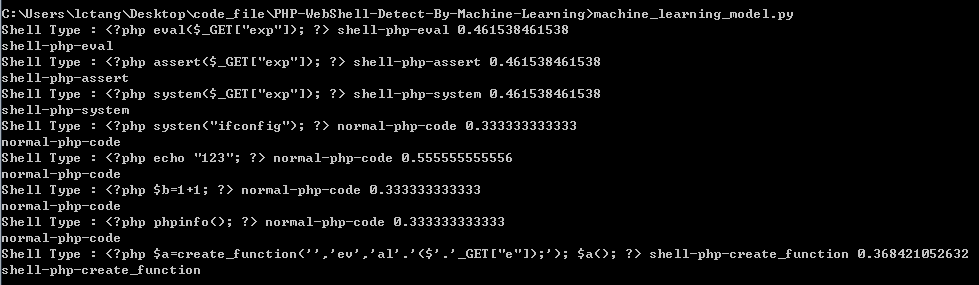
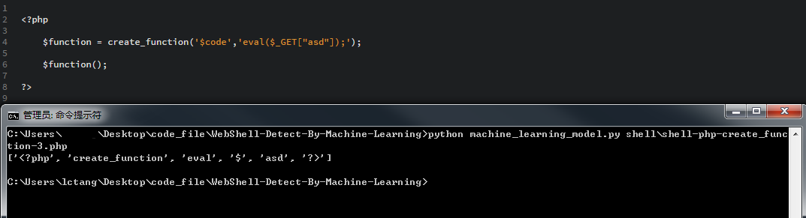

## 使用机器学习识别WebShell

  学习样本在**shell** 目录,目前样本较少,疏漏之处在所难免,测试结果如下:
  
  

## 实现原理

  实现原理是使用朴素贝叶斯进行文本分类.分类的样本包含正常的代码与WebShell 代码,为了方便后面的阅读,可以先阅读下面两个链接:
  
  [朴素贝叶斯原理](http://blog.csdn.net/u012162613/article/details/48323777)
  [朴素贝叶斯分类文本](http://www.cnblogs.com/XBWer/archive/2014/07/13/3840736.html)
  
  站在朴素贝叶斯算法来看,代码其实就是一串文本,我们要做的第一件事就是要对文本进行处理,变成算法可以处理的形式
  
```python

    def code_word_to_vector(php_code) :
        filter_flag_list = ['@','[',']','(',')','{','}','\'','"',',',';','=','.','\t','\n','\r\n']
        keyword = ['$_GET','$_POST','$_REQUEST','$_COOKIE']

        for filter_flag_index in filter_flag_list :
            php_code = php_code.replace(filter_flag_index,' ')

        vector = php_code.split(' ')

        for index in range(len(vector)) :  #  filter $ variant
            if vector[index].startswith('$') and not vector[index] in keyword :
                vector[index] = ''
            elif vector[index] in keyword :
                vector[index] = '$'

        while vector.count('') :  #  filter empty item ..
            vector.remove('')

        return vector

```
  
  预处理代码的算法做下面的工作:
  
  1.`filter_flag_list` 只的是即将要过滤掉的字符,把它们替换成空格;`keyword` 的意思是,只保留这些关键的全局变量,那些无用的变量全部去除掉,否则变量名的文本在样本中和被检测的代码中也出现的话会影响概率计算结果<br/>
  2.以空格字符作为分隔符,分割出所有的文本<br/>
  3.过滤PHP 变量,只允许全局变量($_GET ,$_POST ,$_REQUEST ,$_COOKIE )的出现<br/>
  4.从已经处理好的文本列表里面去除空内容(这里受到空格分隔符的影响,会有很多这样的空白内容)
  
  代码处理后的效果
  
  
  
  处理完成代码之后,下一步就是加载数据集,来看看代码
  
```python

    def load_and_train_model(data_set_path = 'shell') :
        file_list = os.listdir(data_set_path)
        shell_sample = {}          #  classfy set ..

        for file_index in file_list :
            try :
                file_information = file_index.split('-')
                classfy_type = file_information[0] + '-' + file_information[1] + '-' + file_information[2]
                php_code_vector = shell_detect.code_word_to_vector(shell_detect.read_file(data_set_path + '\\' + file_index))

                if not shell_sample.has_key(classfy_type) :
                    shell_sample[classfy_type] = []

                shell_sample[classfy_type].append(php_code_vector)
            except :
                print 'Error Shell Sample File !' , file_index
                print 'Sample File Name Format :'
                print ' normal-%shell_language%-%shell_type%-%shell_index%.php or '
                print ' shell-%shell_language%-%shell_type%-%shell_index%.php '

        return shell_sample
        
```
  
  加载数据集的代码主要做下面的工作:
  
  1.根据指定的样本目录来读取训练的样本数据<br/>
  2.样本数据文件的命名中包含了正常的代码和WebShell 的类型,命名规则为:**样本类型-语言-代码类型-序号.拓展名**,命名为normal-php-code-0.php 的文件的意思是这个样本文件是正常的PHP 代码文件,最后的0 代表着样本文件序号;命名为shell-php-eval-0.php 的意思是PHP 的eval() 函数的WebShell 样本文件<br/>
  3.把这些样本文件读取出来预处理一下再放到样本集中
  
  样本数据加载完成之后,接下来就是要对我们需要检测的文件做一个分类,思路是判断检测文件在各个样本中出现的概率,找到最大概率的那个就是对应的代码类别
  
```python

    def try_classify(self,php_code) :
        php_code_vector = shell_detect.code_word_to_vector(php_code)
        alpha = 1
        p_list = {}

        for key_index in self.shell_sample.keys() :
            max_p_value = 0

            for shell_sample_index in self.shell_sample[key_index] :
                found_vector_in_shell_sample_count = 0

                for php_code_vector_index in php_code_vector :
                    if php_code_vector_index in shell_sample_index :
                        found_vector_in_shell_sample_count += shell_sample_index.count(php_code_vector_index)

                p_value = (found_vector_in_shell_sample_count + alpha) / float(len(shell_sample_index) * 2 + alpha)
                
                if p_value >= max_p_value :
                    max_p_value = p_value

            p_list[key_index] = max_p_value
            
        max_p_value = 0
        max_p_type_name = ''

        for p_type_name_index in p_list.keys() :
            p_value = p_list[p_type_name_index]

            if p_value >= max_p_value :
                max_p_value = p_value
                max_p_type_name = p_type_name_index
                
    return max_p_type_name
  
```
  
  分类函数的逻辑如下:
  
  1.对要检测的代码进行预处理<br/>
  2.遍历所有的样本文件,使用朴素贝叶斯算法对所有的样本进行概率计算<br/>
  3.找到概率最大的那个样本的类别<br/>
  4.返回最后分类的结果
  
  代码处理与分类算法已经介绍完,样本也是重要的一部分,接下来我们来看一下样本的构造
  
```php

//  shell-php-eval-0.php

<?php

    eval($_GET['test']);

?>


//  shell-php-eval-4.php

<?php eval(str_rot13('riny($_CBFG[cntr]);')); ?>


//  shell-php-create_function-3.php

<?php

    $function = create_function('$code','eval($_GET["asd"]);');

    $function();

?>


//  shell-php-assert-1.php

<?php array_map("ass\x65rt",(array)$_REQUEST['expdoor']);?>


//  shell-php-preg_replace-1.php

<?php

    $page = $_POST['page'];
    preg_replace("/[errorpage]/e",$page,"saft");

?>


//  normal-php-code-0.php

<?php

    echo '123';

?>


//  normal-php-code-2.php

<?php

    $sum = 0;

    for ($index = 1;$index < 10 ;$index++)
        $sum += $index;

?>

```
  
  样本的构造基本上是使用已知的WebShell 并且做一个归类.正常的代码这里只使用一些简单的PHP 语句,如果没有正常的代码,会导致概率的判断全部都会归类到WebShell 代码的范畴.
  
  测试样本
  
```python

        print 'Shell Type :' , model.try_classify('<?php eval($_GET["exp"]); ?>')
        print 'Shell Type :' , model.try_classify('<?php assert($_GET["exp"]); ?>')
        print 'Shell Type :' , model.try_classify('<?php system($_GET["exp"]); ?>')
        print 'Shell Type :' , model.try_classify('<?php systen("ifconfig"); ?>')
        print 'Shell Type :' , model.try_classify('<?php echo "123"; ?>')
        print 'Shell Type :' , model.try_classify('<?php $b=1+1; ?>')
        print 'Shell Type :' , model.try_classify('<?php phpinfo(); ?>')
        print 'Shell Type :' , model.try_classify('<?php $a=create_function(\'\',\'ev\',\'al\'.\'($\'.\'_GET["e"]);\'); $a(); ?>')
        print 'Shell Type :' , model.try_classify('<?php include($_COOKIE[\'s\']); ?>')
        print 'Shell Type :' , model.try_classify('<?php require_once($_POST[\'s\']); ?>')

```
  
  测试结果
  
  

